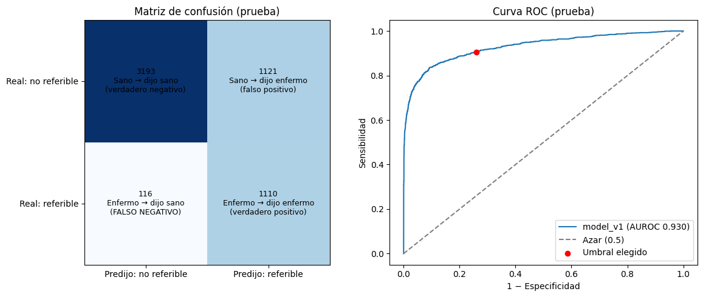

# diabetic-retinopathy-screening

An EfficientNet-B0 fine-tuned on APTOS 2019 and EyePACS flags referable diabetic retinopathy (ICDR ≥ 2) at 90.5% sensitivity and 74.0% specificity on 5 540 test images from patients it never saw (AUROC 0.930).

Diego G. Salas · data from APTOS 2019 Blindness Detection (Kaggle, 3 662 images) and EyePACS, the train set of the Kaggle Diabetic Retinopathy Detection challenge (35 126 images), used through a 384 px copy prepared by C. Montoya

## Run it

```bash
micromamba create -n diabetic-retinopathy-screening -f environment.yml && micromamba activate diabetic-retinopathy-screening
bash run.sh
```

Runs on `tests/data` (80 synthetic images, 1.2 MB) in 40 s on a laptop CPU. `DRY_RUN=1` prints the commands. `CONFIG=config/config.sh bash run.sh` runs the full data with the model_v3 parameters. It needs `~/.kaggle/kaggle.json`, access to the EyePACS copy and a GPU (12 epochs took 75.8 min on a Colab T4).

| Stage | Script | Output |
|---|---|---|
| 01 | `workflow/01_download.sh` | Kaggle downloads in `data/raw/<name>` |
| 02 | `workflow/02_manifest.py` | one schema for all datasets, images with a missing file dropped |
| 03 | `workflow/03_preprocess.py` | black border cropped, padded to square, resized, optional CLAHE |
| 04 | `workflow/04_split.py` | train / validation / test by patient, stratified by grade |
| 05 | `workflow/05_train.py` | best-validation weights, checkpoint per epoch, resumable |
| 06 | `workflow/06_evaluate.py` | threshold chosen on validation, metrics with 95% CI on test, model card |

## Main result

| Run | Data | Split unit | Test images (referable) | Threshold | AUROC [95% CI] | Sensitivity [95% CI] | Specificity [95% CI] |
|---|---|---|---|---|---|---|---|
| model_v1 | APTOS | image | 550 (223) | 0.445 | 0.981 [0.972–0.989] | 94.2% [90.3–96.6] | 91.4% [87.9–94.0] |
| model_v3 | APTOS + EyePACS | patient | 5 540 (1 226) | 0.057 | 0.930 [0.920–0.939] | 90.5% [88.8–92.1] | 74.0% [72.7–75.3] |

The source is `results/colab_runs.tsv`, extracted by `python notebooks/extract_runs.py` from `results/model_v1.json` and the outputs of `notebooks/RD_02_APTOS_EyePACS_v3_checkpoint.ipynb`. The threshold is the one that reaches 90% sensitivity on validation, and test is evaluated once. Sensitivity and specificity carry Wilson intervals, AUROC a 1 000-resample bootstrap.

The two rows are not a like-for-like comparison. model_v1 is tested on 550 APTOS images split per image, model_v3 on 5 540 images, most of them EyePACS, split per patient. At the same 90% sensitivity target, the second setting lets 1 121 of 4 314 non-referable images through as referrals (26.0%), against 28 of 327 (8.6%) in the first.



*model_v3 on test, figure archived from the Colab run. The legend reads "model_v1" because the notebook hard-coded that label, but the counts and the AUROC are model_v3's. The training curve is in `results/figures/model_v3_training_curve.png` (validation AUROC peaked at 0.9265 in epoch 6 of 12).*

## Confirmed vs not confirmed

| Claim | Status | Basis |
|---|---|---|
| model_v3 reaches AUROC 0.930, sensitivity 90.5%, specificity 74.0% | single run, one seed | printed output of the archived notebook, weights not in this repository |
| model_v1 reaches AUROC 0.981, sensitivity 94.2%, specificity 91.4% | single run, one seed | `results/model_v1.json`, weights load into stage 06 with all keys matched, the training code was overwritten |
| model_v2 reached AUROC 0.924, specificity 73.2% | discarded | its test had 5 018 images while the split printed in the same notebook had 5 540, see `PROGRESS.md` |
| The six scripts run end to end | confirmed on the synthetic test set only | two clean runs with identical losses and AUROCs (`PROGRESS.md`, Session 1) |
| Stage 05 resumes from its checkpoint and refuses a changed configuration | confirmed on the synthetic test set only | weights deleted, rerun resumed at epoch 3, `--epochs 3` stopped with an error (`PROGRESS.md`, Session 1) |
| The scripts rebuild the model_v3 split | not confirmed | from the public label files, 27 705 / 5 541 / 5 541 images against 27 706 / 5 541 / 5 540 in Colab (`results/split_check.tsv`). An exact check needs the labels of the 384 px copy |
| The scripts reproduce the model_v3 metrics | not run | needs a GPU and access to the EyePACS copy |

## Limitations

- APTOS has no patient identifier, so each APTOS image counts as its own patient. In model_v1, which used APTOS alone, the per-image split cannot rule out the same eye in train and test.
- The 90%-sensitivity threshold of model_v3 is 0.057, so an image is referred when the model gives it 5.7% probability or more. Calibration was not measured.
- EyePACS dominates model_v3 (35 125 of 38 787 images). Metrics per dataset are now computed by stage 06 (`<version>_by_source.tsv`) but were not in the Colab run.
- The EyePACS copy used for training (`cristbalmontoyabao/atros-dataset`) returned 403 Forbidden to the Kaggle account in `~/.kaggle` of the machine that built this repository, and the public `trainLabels.csv` does not reproduce its split exactly. A third party cannot rebuild model_v3 from this repository today.
- All images come from desktop fundus cameras. Nothing here measures performance on smartphone or other low-cost cameras.
- Synthetic test images check that every stage runs. They say nothing about retinopathy.

## Not done on purpose

- No cross-device evaluation (IDRiD, mBRSET) in this repository. It lives in a separate Colab notebook and will be ported as a stage 07.
- No Grad-CAM or other saliency maps.
- No CLAHE run. The switch exists (`useClahe`) but every reported run used `0`.
- No model weights in git, since `models/` is ignored. `model_v1.pt` (16 MB) stays local, and the notebook saved `model_v3.pt` to Google Drive (`Retinopatia_modelos LOCAL/`).
- No hyperparameter search. One seed, the parameters of the Colab notebook.
